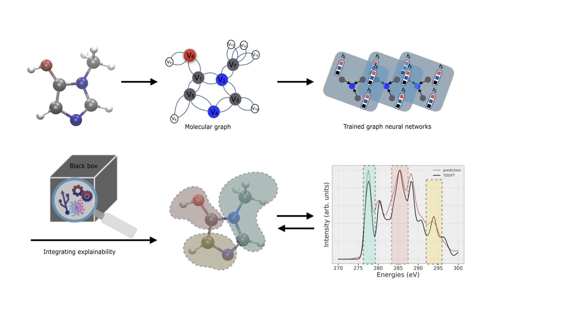

# XASNet - Graph Neural Network models to predict X-ray absorption spectra



XASNet is a graph neural network (GNN) model to predict X-ray absorption spectra (XAS) of small molecules while maintaing the explainibility of the predicted spectra. It can be chosen based on different GNN architectures, i.e. [GraphNet](https://arxiv.org/abs/1806.01261), [graph convolutional neural network (GCN)](https://arxiv.org/abs/1509.09292), [multi-head graph attention network (GATv2)](https://arxiv.org/abs/1710.10903). XASNet can be trained on datasets of 3d molecules with variable sizes composed of the first- and second row of main group elements H, C, N, O, and F. Here, we trained the GNN models on custom-generated carbon K-edge XAS dataset of 65k small organic molecules (subset of original QM9), denoted as QM9-XAS. 

To explain the predictions, feature attributions are employed to determine the respective contributions of various atoms in the molecules to the peaks observed in the XAS spectrum. Here, we also developed a method which assigns the ground-truth contributions of various atoms in a molecule to a peak in the TDDFT spectrum. The developed data pipeline produces atoms labels denoting whether a particular atom conztibute to an XAS peak.

### Content

+ [Installation](/README.md#installation)
+ [Command-line interface and configuration](/README.md#command-line-interface-and-configuration)
  + [Model training](/README.md#model-training)
    + [Hyperparameters and experiment settings](/README.md#hyperparameters-and-experiment-settings)


## <div align="center">Documentation</div>

Quickstart installation and usage example is given below. Training, prediction and explainability of XAS spectra are given in the example.  


# Installation

To install `XASNet-XAI`, download this repository and use pip.

```
git clone https://github.com/Amirktb1994/XASNet-XAI
conda create -n xasnet-xai numpy
conda activate xasnet-xai
pip install ./XASNet-XAI
```

# Python
