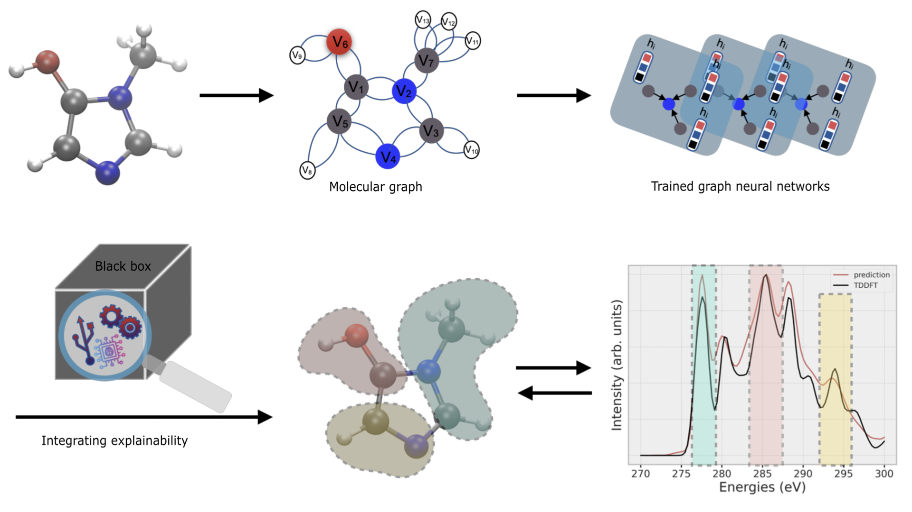

# XASNet - Graph Neural Network models to predict X-ray absorption spectra

XASNet is a graph neural network model to predict X-ray absorption spectra of small molecules while maintaing the explainibility of the predicted spectra. It can be chosen based on different architectures, i.e. [GraphNet](https://arxiv.org/abs/1806.01261), [graph convolutional neural network (GCN)](https://arxiv.org/abs/1509.09292), [multi-head graph attention network (GATv2)](https://arxiv.org/abs/1710.10903). 